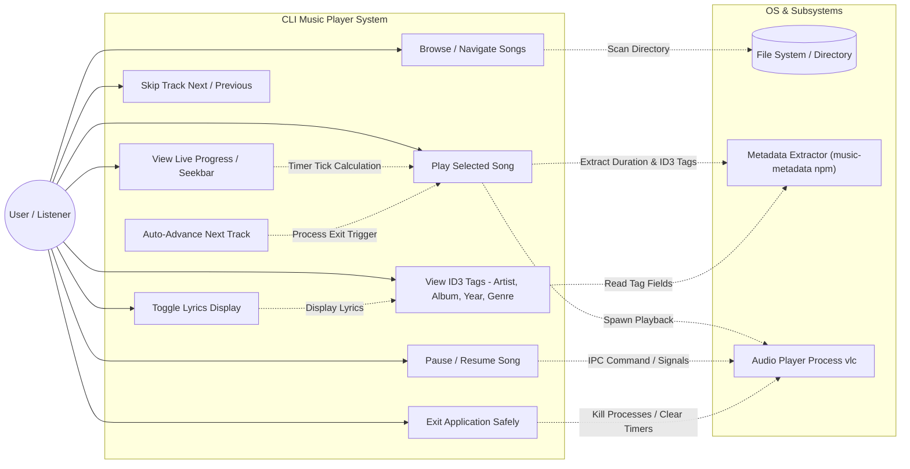
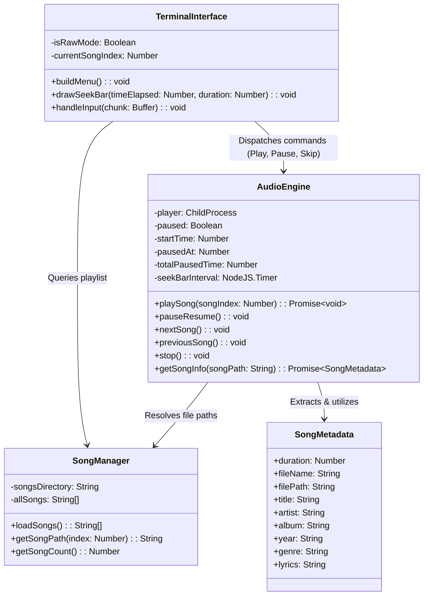
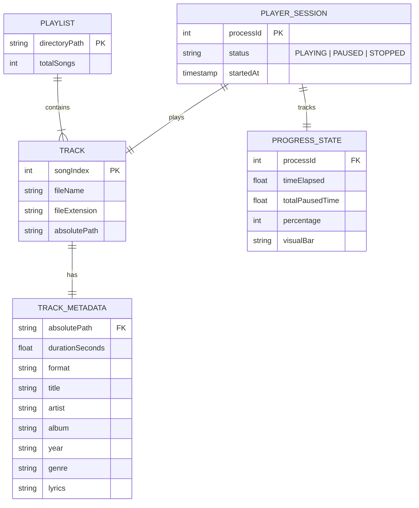

# CLI Music Player - System Architecture & Specification

## 1. System Overview
The **CLI Music Player** is a terminal-based interactive audio player developed in Node.js. It features raw-mode terminal event handling, in-place ANSI rendering, ID3 tag metadata extraction (artist, album, year, genre, lyrics via `music-metadata`), background process spawning for playback via VLC, time-accurate playback tracking with pausing capabilities, a dynamic progress seek bar, animated audio visualizer, volume control, multiple color themes, and embedded lyrics display.

---

## 2. Use Case Diagram

---

## 3. UML Class / Module Diagram

---

## 4. Entity-Relationship (ER) Diagram / Data Model

---
